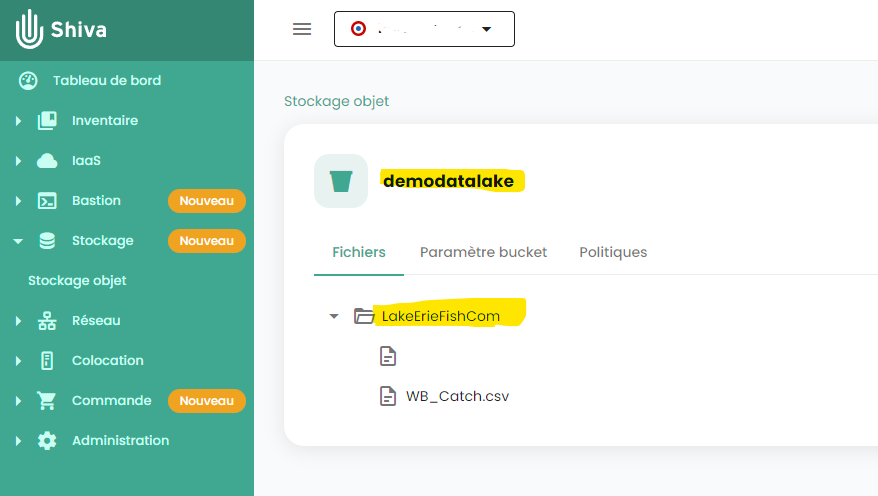
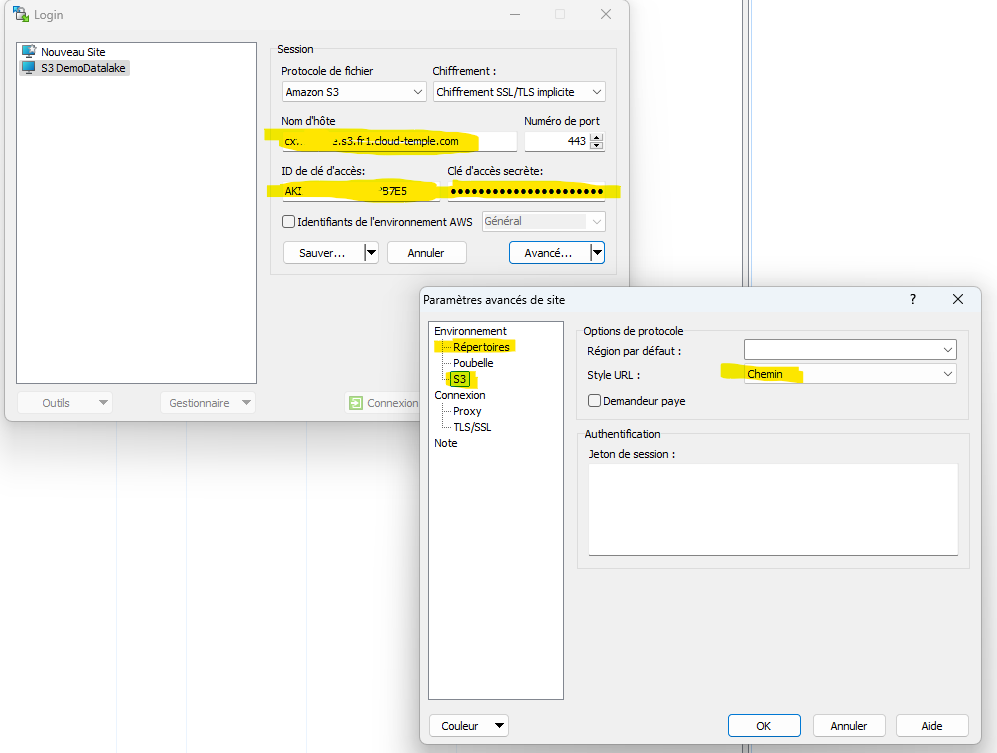
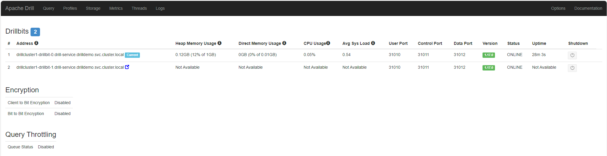
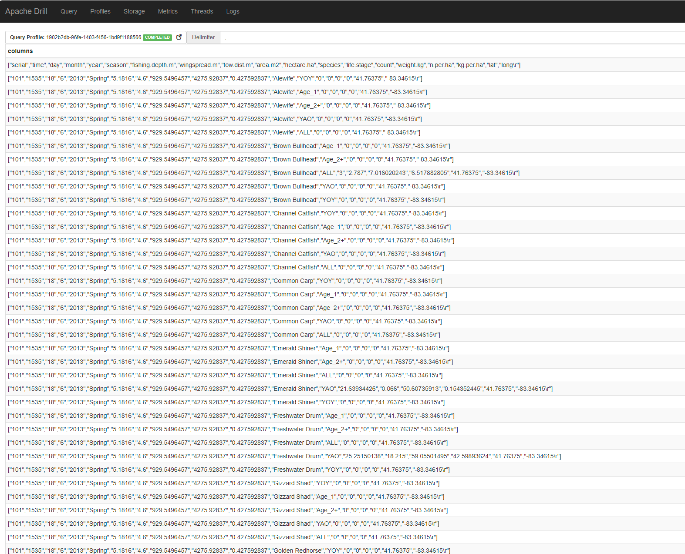

# Helm Charts for Apache Drill

## Overview
This repository contains a collection of files that can be used to deploy [Apache Drill](http://drill.apache.org/) on Kubernetes using Helm Charts. Supports single-node and [cluster](http://drill.apache.org/docs/installing-drill-in-distributed-mode/) modes.

These configuration files are based on https://github.com/thinkingmachines/drill-helm-charts/
with a few modifications :
- support kubernetes 1.22+ ( rbac.authorization.k8s.io/v1beta1 => rbac.authorization.k8s.io/v1 )
- includes an additional configuration (mount a configmap into /opt/drill/conf/core-site.xml) to allow Cloud-Temple S3 storage access (or any Minio compatible S3 storage)


This a Proof of Concept/ Demo of how to use a Kubernetes Cluster to access Cloud-Temple S3 object storage.
All infrastructure components are under SecNumCloud label.


#### What are Helm and Charts?
[Helm](https://helm.sh/) is a package manager for [Kubernetes](https://kubernetes.io/). [Charts](https://helm.sh/docs/topics/charts/) are a packaging format in Helm that can simplify deploying Kubernetes applications such as Drill Clusters.

## Pre-requisites

- A Kubernetes Cluster (this project is tested using Cloud-Temple "Vanilla Kubernetes automated deployment" - aka SNCK)
- [Helm](https://github.com/helm/helm#install) version 3 or greater
- [Kubectl](https://kubernetes.io/docs/tasks/tools/install-kubectl/) version 1.22.0 or greater (tested on 1.30.4)
- A Cloud-Temple tenant, with Shiva access and S3 Object Storage


## Preparing the Cloud-Temple S3 Datalake

- Connect to your Cloud-Temple UI (Shiva), and go to "Storage" \ "Object Storage"
- create a new bucket (we'll use 'demodatalake' for the POC)
- Create a new storage account, and note the AccessKey and the Secret
- Assign the account to the bucket
- Check bucket parameters and ensure firewall access is ok (Public, or Custom Access with correct IP allowed )



- update the S3 credentials in Drill config:
- Go to /drill/conf/ folder and edit the [core-site.xml] with the S3 parameters
```
<configuration>

    <property>
        <name>fs.s3a.access.key</name>
        <value>YOUR ACCESS KEY HERE</value>
    </property>

    <property>
        <name>fs.s3a.secret.key</name>
        <value>YOUR SECRET HERE</value>
    </property>

    <property>
      <name>fs.s3a.endpoint</name>
      <value>https://<the cloud-temple S3 url>.s3.fr1.cloud-temple.com</value>
    </property>

    <property>
      <name>fs.s3a.connection.ssl.enabled</name>
      <value>true</value>
    </property>

    <property>
      <name>fs.s3a.path.style.access</name>
      <value>true</value>
    </property>

    <property>
      <name>fs.s3a.impl.disable.cache</name>
      <value>true</value>
    </property>
```
</configuration>


## upload datalake test datas

- Connect to this bucket using WinSCP (latest version to ensure compatibility with Cloud-Temple S3)
  - Hostname : your bucket url.s3.fr1.cloud-temple.com
  - Key ID = the account Access key
  - Secret Key : the account secret
  - Use TLS : YES - implicit
  - in "advanced parameters":
  - "S3" : URL Style : "path"
  - "folders" : remote folder : /bucket name   ( here : /demodatalake  )



- Connect your bucket, and upload the LakeErieFishCom folder in it (you can find this folder in the \samples folder)

note : we'll use data from : https://www.sciencebase.gov/catalog/item/56951c63e4b039675d005ed9


## Prepare kubernetes

- Create a new namespace

kubectl create ns drilldemo

- create the required configmaps
```
cd ./drill/conf/
kubectl create configmap drill-config-cm --from-file=drill-override.conf --from-file=drill-env.sh -n drilldemo
kubectl create configmap drill-coresite-cm --from-file=core-site.xml  -n drilldemo
```
- install the helm chart from local files

cd ../..

helm upgrade drill drill/ --set global.namespace=drilldemo --set drill.id=drillcluster1


=> this will deploy 2 drill-bits and 1 zookeeper quorum (standalone zk)
```
kubectl get pods -n drilldemo
NAME                       READY   STATUS    RESTARTS   AGE
drillcluster1-drillbit-0   1/1     Running   0          74s
drillcluster1-drillbit-1   1/1     Running   0          74s
zk-0                       1/1     Running   0          74s
```

## access the Drill-bit UI

kubectl port-forward --namespace drilldemo service/drill-service 8047:8047

and open your favorite brower using http://localhost:8047

you should see the 


## Configure the storage

- Go to "storage"
- click "create" on plugin management
- Storage name : "demodatalake" (this is the name will use in the queries / the schema name)
- Configuration : copy/paste the content of \samples\s3-lake.json
```
    {
    "type": "file",
    "enabled": true,
    "connection": "s3a://demodatalake",
    "config": null,
    "workspaces": {
      "root": {
        "location": "/",
        "writable": false,
        "defaultInputFormat": null
      },
      "LakeErieFishCom": {
        "location": "/LakeErieFishCom/",
        "writable": false,
        "defaultInputFormat": null
      }
```

remarks:
- connection : when connecting to S3 using S3a lib, the final endpoint will be <fs.s3a.endpoint>/demodatalake   ( endpoint is set in core-site.xml, ans bucket is specified here)
- workspaces : this is how we configure folder access in the datalake. Here we have a 'root' (/) and a 'LakeErieFishCom' (/LakeErieFishCom/) workspaces.

## testing data access !
- In Drill Web UI, go to Query (type SQL)
- You can test access to workspaces using:
```
USE demodatalake.root;
or
USE demodatalake.LakeErieFishCom;
```
you should have "OK" Default schema changed to [demodatalake.lakeeriefishcom]


- query the sample csv file:
```
SELECT * FROM demodatalake.LakeErieFishCom.`WB_Catch.csv`;
```


## Removing ressources:
